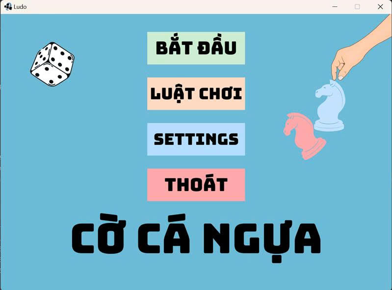
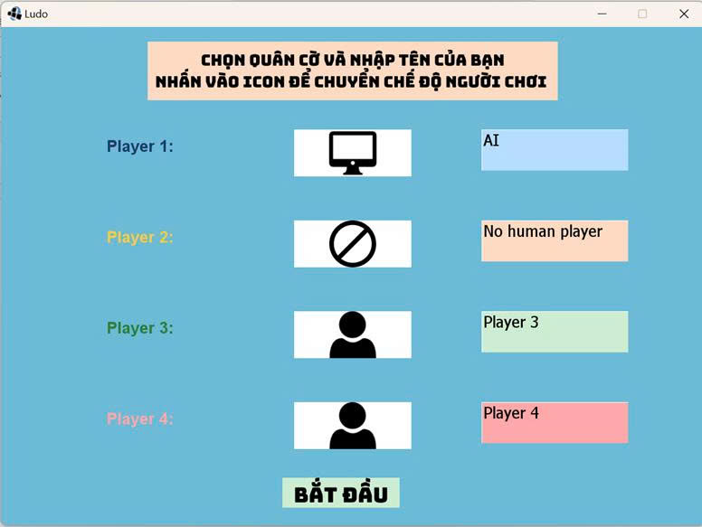
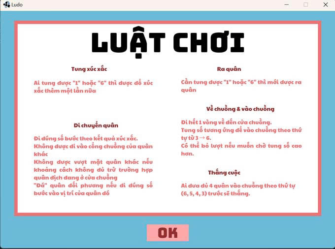
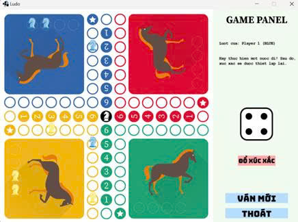
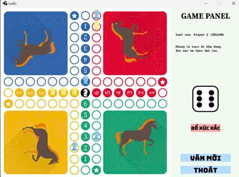
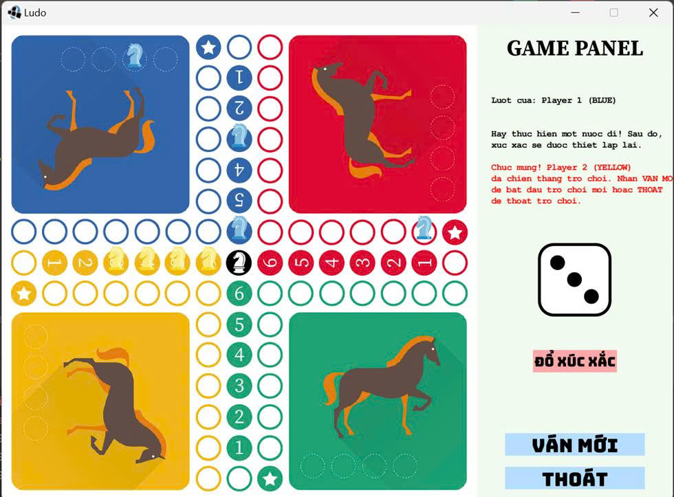

# 🐎 GAME CỜ CÁ NGỰA – VN-Ludo123

**Một phiên bản sinh động của trò chơi bàn cổ điển Ludo**, được phát triển bằng **Java** kết hợp thư viện **Slick2D + LWJGL**.  
Trò chơi hỗ trợ nhiều chế độ người chơi (Người – Máy – Không tham gia), hiệu ứng xúc xắc ngẫu nhiên, di chuyển quân, đá quân đối phương, đưa quân về chuồng,...

---

## 🚀 Tính năng nổi bật

- 🎨 Bàn cờ Ludo sinh động, đẹp mắt  
- 🎲 Xúc xắc quay ngẫu nhiên và hiển thị trực quan  
- 🧠 Hỗ trợ nhiều chế độ: Người chơi / Máy / Không tham gia  
- 🚗 Di chuyển, đánh bật quân đối thủ và về đích  
- ⟳ Nút **"Ván Mới"** giúp khởi động lại trò chơi nhanh chóng  
- ⏱ Hiển thị luật chơi và các thông báo rõ ràng  

---

## 📜 Luật chơi

- Bấm **"Bắt đầu"** ở menu để chọn chế độ cho mỗi người chơi.
- Bấm **"Bắt đầu"** ở phần thiết lập để vào giao diện chơi.
- Nhấn **"Đổ xúc xắc"** để quay xúc xắc.
- Ra **1 hoặc 6** để được xuất quân.
- Nếu đã có quân trên bàn: di chuyển đúng số bước, không đi vào ô đầu màu khác.
- Ra 1 hoặc 6 khi có quân trên bàn sẽ được quay thêm lượt.
- Nếu đi vào ô có quân đối phương (trừ ô xuất chuồng) → **đá về nhà**.
- Không được nhảy qua quân khác (trừ khi đang ở ô xuất chuồng).
- Người đầu tiên đưa **4 quân về đích** sẽ thắng.

---

## ⚙️ Cách chạy game

### ✅ Yêu cầu:

- Java JDK **21**
- IDE: **IntelliJ IDEA** (hoặc Eclipse nếu đã cấu hình đúng)
- Thư viện:
  - Slick2D
  - LWJGL (Native libraries)

### ✅ Hướng dẫn:

# 1. Tải source code:
git clone https://github.com/kim-anh-204/VN-Ludo123.git

# 2. Cài đặt thư viện:
#    - Thêm jars: File > Project Structure > Modules > Dependencies > "+" > Add JARs or directories
#    - Thêm VM Options:
-Djava.library.path="C:\\duong_dan_toi\\VN-Ludo123\\lib\\natives\\windows"

> *(Thay bằng đúng đường dẫn thư mục \`natives\` trên máy bạn)*

---

## 🖼️ Giao diện trò chơi

| Chức năng                     | Ảnh minh họa                                |
|-------------------------------|---------------------------------------------|
| 🔹 Giao diện bắt đầu          |                          |
| 🛠️ Thiết lập trò chơi         |                |
| 📜 Giao diện luật chơi         |                        |
| 🧭 Trước khi bị đá            |           |
| 💥 Sau khi bị đá              |             |
| 🚫 Không có nước đi khả dụng |   |
| 🏆 Giao diện khi thắng        |               |

👉 Xem báo cáo tại: [**TTNT_Nhom11_Final.docx**](TTNT_Nhom11_Final.docx)
> *(Nếu file không hiển thị trực tiếp, vui lòng click phải → Save As để tải về.)*

